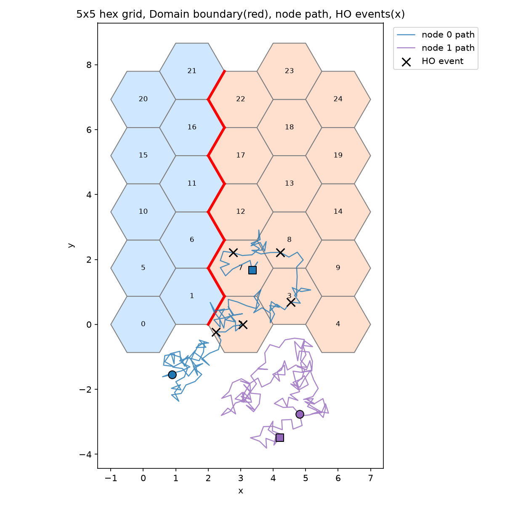

# wireless-mobility-sim

무선통신망의 위치관리(LM)·핸드오버(HO) 시그널링 오버헤드와, Domain(Access Network) 전환 시 발생하는 세션 커넥티비티(IP 변경) 문제를 함께 측정하는 Python 시뮬레이터입니다. Baseline(즉시 전환) / 개선된 전통기법(히스테리시스+타이머) / AI(마르코프 체인 예측) 3가지 알고리즘을 같은 조건에서 비교합니다.

5x5 육각 셀 격자를 2개 Domain으로 나눈 환경에서 단말기 여러 개를 이동시키며, 알고리즘별로 시그널링 오버헤드·핑퐁 HO 비율·콜 드랍 근사치·세션 연속성·(AI의 경우) 예측 정확도를 CSV와 그래프로 비교합니다.



## 설치

```bash
pip install -r requirements.txt
```

## 사용법

```bash
# 메인 파이프라인: 파라미터 스윕(cell_size × speed × num_nodes) × 3알고리즘, 10시드 반복실험
# → results/05_raw_data/*.csv, results/02_sensitivity/*.png, results/03_special_analysis/heatmap_*.png
python run_experiment.py

# 대표 조합 3알고리즘 막대그래프 스냅샷 → results/01_main_comparison/
python bar_chart_snapshot.py

# baseline/improved/ai 쌍체 t-검정 → results/04_validation/statistical_test_results.csv
python statistical_test.py

# num_nodes 100/500/1000 확장성 벤치마크 → results/04_validation/scalability_benchmark.png
python scalability_benchmark.py

# 5x5 토폴로지 + Domain 경계 + 이동 경로 + HO 지점 시각화 → results/03_special_analysis/topology_visualization.png
python visualize_topology.py

# 지금까지의 비교 결과를 한 화면에서 보는 대시보드
streamlit run dashboard.py

# 핵심 함수 테스트
pytest tests/ -v
```

## 프로젝트 구조

```
simulator/
  topology.py       육각 셀 격자 생성, 셀 인접관계, Domain 분할
  mobility.py        MobileNode 상태, 이동모델 3종(random_walk/random_waypoint/manhattan_grid), 신호세기
  baseline.py         Baseline: 즉시 전환 HO + 고정 주기 LU + 전체 셀 페이징
  improved.py          개선된 전통기법: 히스테리시스+타이머 HO + 독립 주기 LU
  ai_predictor.py       마르코프 예측(0차/1차) + AI LM/HO (예측 방향 히스테리시스 완화, 페이징 범위 축소)
  session.py            세션 커넥티비티: (application_id, port, ip_address) 튜플, domain 변경 시 IP 재할당
  metrics.py             시그널링 오버헤드/핑퐁 비율/콜 드랍 근사치/예측 정확도/세션 지표 계산

run_experiment.py, bar_chart_snapshot.py, statistical_test.py,
scalability_benchmark.py, visualize_topology.py, dashboard.py, tests/
```

## 결과

`results/`는 5개 폴더(01_main_comparison ~ 05_raw_data)로 정리되어 있습니다. 파일별 설명은 **[results/INDEX.md](results/INDEX.md)** 참고.

## 더 보기

- **[CLAUDE.md](CLAUDE.md)** — 프로젝트 개요, 핵심 개념(LM/HO, 세션 커넥티비티, CBN/PBN 배경), 진행 현황
- **[FINDINGS.md](FINDINGS.md)** — 실험 중 나온 예상 밖 결과·트레이드오프 기록
